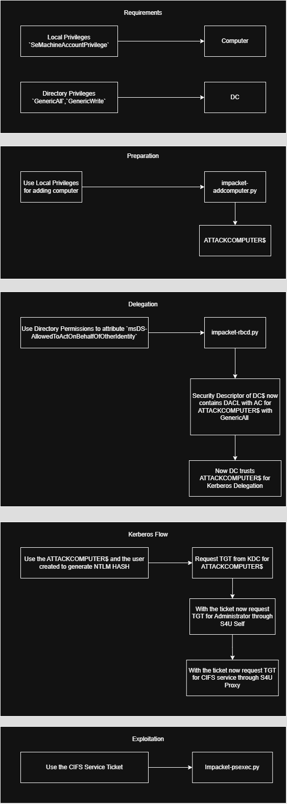

# Role Based Constrained Delegation Attack

## Requirements

RBCD Attack, stands for Resource-Based Constrained Delegation Attack. A long name, for a long chain!

High-level, there are a few permissions that got to be in place for this to work:

| Local Rights              | AD Permissions                   |
| ------------------------- | -------------------------------- |
| SeMachineAccountPrivilege | GenericAll, GenericWrite over DC |

***

## Peeling back the layers

This attack works through the layers of:

1. The machine-level layer where we have the `SeMachineAccountPrivilege` that gives us permission to add a new computer in the domain.
2. The directory-level layer where we have `GenericAll, GenericWrite over DC` and we are able to add a new attribute to DC machine `msDS-AllowedToActOnBehalfOfOtherIdentity`
3. The Kerberos-level layer where we meet extended features like S4U Self and S4U Proxy where use the attribute above to generate ticket for CIFS service.

This is on a high level, but why does this even work? Apart from the misconfiguration of being a regular user with GenericAll permissions over the DC, architecturally this goes back to the origins of enhancing or adding some features that Windows NT lacked.

***

## Historical Facts

This attack is cool. Let's go back in time.\
It's the early 90s, just some Intel 386s or 486 CPUs rocking the 33-66MHz around you running the new mighty Windows NT 3.1, goodbye MS-DOS! The 4-8MB RAM was happy to box the fresh LSA process! That's right, that's when LSA made a bump.

Originally Microsoft started developing Windows NT back in the 88s, but released it in 1993, featuring the core security principles of Windows:

* Security Principals
* Security Identifiers (SIDs)
* Local Security Authority (LSA)
* Security Descriptors and Discretionary Access Control Lists
* Access Control Entities (ACEs)
* Privilege Model

Inspiration came from VMS (Virtual Memory System) OS. VMS had a sophisticated security control framework for it's time, and couple of core architects, including the lead architect (Dave Cutler) worked on VMS prior to working for Microsoft.

Even though Windows NT 3.1 was a breakthrough for Windows and for that time, years to come and an update was required to support the enterprise eco-system that came.\
Basically, Windows year-by-year fulfilled the needs that existed at that time, adding layer on top of layer.

So, years have passed, requirements became more and more clear and Windows 2000 arrived introducing Active Directory and Kerberos came. This has led to two distinct worlds but interconnected: The Local Security Architecture and the Directory Security Architecture. This is why this attack is fascinating, it's a mixture of these layers. Why did they keep the LSA Architecture? Because they focused on compatibility.

Then came the challenge of multi-layer applications, where you have a front-end server needing to talk to another server from back-end hosting a database. That's when Windows released constrained delegation back in 2003, but it required Domain Admin privileges, so it was creating bottle-necks. This year extended features for Kerberos were released, such as S4U Self and S4U Proxy.

Years later, it's 2012 and Windows Server 2012 addressed these needs via RBCD, Resource-Based Constrained Delegation, it decentralized management and made it more flexible, but it also added security implications.

***

## Anatomy

This attack works through the layers of:

1. The machine-level layer where we have the `SeMachineAccountPrivilege` that gives us permission to add a new computer in the domain.
2. The directory-level layer where we have `GenericAll, GenericWrite over DC` and we are able to add a new attribute to DC machine `msDS-AllowedToActOnBehalfOfOtherIdentity`. We're actually adding a full security descriptor (the same data structure used throughout Windows for access control) that contains an ACE (Access Control Entry) with the SID of our ATTACKCOMPUTER$. This creates a trust relationship where the DC explicitly states 'I trust this computer to perform delegation to me.'
3. The Kerberos-level layer where we meet extended features like S4U Self and S4U Proxy where use the attribute above to generate ticket for CIFS service.

Why CIFS we might ask ourselves? CIFS (Common Internet File System) is always on DC because this provides exceptional access. CIFS/SMB is the Windows file and printer sharing protocol, but at it's roots back in the days it has been created with the Remote Management concept in architecture. It enables it through shares like C, ADMIN and SYSVOL. By obtaining a ticket for Administrator to this service, we get full PSEXEC capabilities.

***

## Practical Example

This[ box ](../../../write-ups/support-write-up-htb.md#privesc-rbcd)I rooted via RBCD Attack Chain.

<figure><figcaption></figcaption></figure>

***

## Defending against it

Organizations can protect against RBCD attacks by carefully monitoring delegation configurations, restricting who can create computer accounts, and most importantly, avoiding overly permissive permissions like GenericAll on critical objects like domain controllers. Additionally, modern security features like Protected Users security groups and authentication policies can help prevent delegation attacks against privileged accounts.
